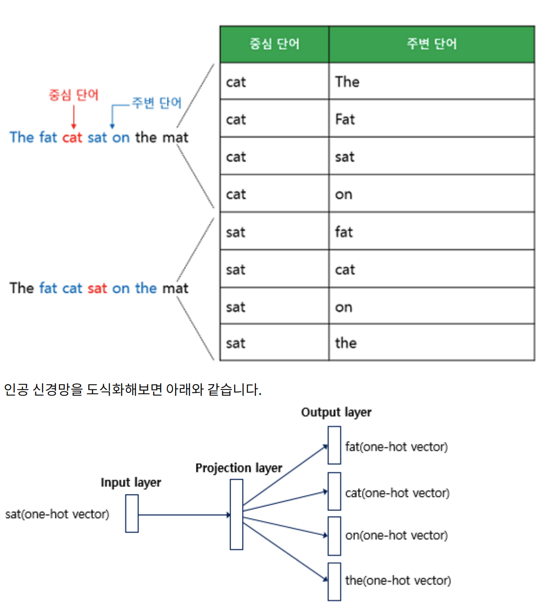

PDF 파일 기준 437페이지부터 시작

## 09-01 워드 임베딩 (Word Embedding)
### 1. 희소 표현 (Sparse Representation)
- 원 핫 벡터: 단어의 인덱스의 값만 1이고, 나머지 인덱스는 0으로 표현
- 벡터 또는 행렬의 값이 대부분 0으로 표현되는 방법을 희소 표현이라고 함.
- 문제점: 단어의 개수가 늘어나면 차원이 한없이 커짐.
    - 단어가 10,000개였다면 차원은 10,000이므로 쓸데 없는 0이 엄청 많음.
    - 강아지 = [0 0 0 0 0 1 0 0 0 0 ... 중략 ... 0] # 1뒤의 0의 수는 9995개

### 2. 밀집 표현 (Dense Representation)
- 사용자가 설정한 값으로 모든 단어의 벡터 표현의 차원을 맞춤.
- 0과 1이 아닌 실수 값을 가짐.
- 밀집 표현을 사용하고, 사용자가 차원을 128로 설정한다면 희소 표현에서 10,000이었던 차원이 128로 바뀌면서 모든 값이 실수가 됨.
    - 강아지 = [0.2 1.8 1.1 ... 중략 ...]

### 3. 워드 임베딩 (Word Embedding)
- 단어를 밀집 벡터의 형태로 표현하는 방법을 워드 임베딩이라고 함.
- 워드 임베딩 방법론: LSA, Word2Vec, FastText, Glove 등

## 09-02 워드투벡터 (Word2Vec)
- 원-핫 벡터는 단어 벡터간 유의미한 유사도를 계산할 수 없음.
- 단어의 의미를 수치화하는 방법이 필요한데, 대표적으로 Word2Vec가 있음.
    - 한국 - 서울 + 도쿄 = 일본
    - 박찬호 - 야구 + 축구 = 호나우두

### 희소 표현 (Sparse Representation)
- 각 단어 벡터간 유의미한 유사성을 표현할 수 없음.
- 단어의 의미를 다차원 공간에 벡터화하는 방법이 있는데, 이를 분산 표현이라고 함.
- 분산 표현을 이용하여 단어 간 의미적 유사성을 벡터화하는 작업을 워드 임베딩이라 부름.

### 분산 표현 (Distributed Representaton)
- 비슷한 문맥에서 등장하는 단어들은 비슷한 의미를 가진다는 가정에서 시작됨.
- 강아지란 단어는 귀엽다, 예쁘다, 애교 등의 단어가 주로 등장하며 이 텍스트의 단어들을 벡터화한다면 유사한 벡터값을 가짐.
- 이처럼 분산 표현은 분포 가설을 이용하여 텍스트를 학습하고, 단어의 의미를 벡터의 여러 차원에 분산하여 표현함.
- 희소 표현: 고차원에 각 차원이 분리된 표현
- 분산 표현: 저차원에 단어의 의미를 여러 차원에다가 분산하여 표현

### CBOW(Continuous Bag of Words)
- Word2Vec의 학습 방식: CBOW vs Skip-Gram
- CBOW: 주변에 있는 단어들을 입력으로 중간에 있는 단어들을 예측
- Skip-Gram: 중간에 있는 단어들을 입력으로 주변 단어들을 예측
- 예문: The fat cat sat on the mat
    - The, fat, cat, on, the, mat 기준으로 sat을 예측하면 CBOW
    - 앞, 뒤로 몇 개의 단어를 볼지 결정해야 하는데 이 범위를 윈도우라고 함.
- 윈도우 크기가 정해지면 윈도우를 옆으로 움직여서 주변 단어와 중심 단어의 선택을 변경해가며 학습을 위한 데이터 셋을 만드는데, 이 방법을 슬라이딩 윈도우라고 함.

- CBOW의 인공 신경망을 간단히 도식화하면 다음과 같음.

### Skip-gram
- 중심 단어에서 주변 단어를 예측

### NNLM vs Word2Vec
- NNLM도 워드 임베딩에 사용할 수 있지만, 느린 학습 속도와 정확도를 개선하여 탄성한 것이 Word2Vec

## 09-04 네거티브 샘플링을 이용한 Word2Vec 구현
### 1. 네거티브 샘플링 (Negative Sampling)
- Word2Vec의 출력층에는 소프트맥스 함수를 지난 단어 집합 크기의 벡터와 실제 값인 원-핫 벡터와의 오차를 구하고 이로부터 임베딩 테이블에 있는 모든 단어에 대한 임베딩 벡터 값을 업데이트함.
- 단어 집합의 크기가 수만 이상에 달하면 성능 이슈가 있음.
- 네거티브 샘플링은 Word2Vec이 학습 과정에서 전체 단어 집합이 아니라 일부 ㄷ나어 집합에만 집중할 수 있도록 하는 방법임.
- 현재 집중하고 있는 주변 단어가 '고양이', '귀여운'이라고 한다면 그 외 '돈가스', '김태현'과 같은 단어 집합에서 무작위로 선택된 주변 단어가 아닌 단어들을 일부 가져옴.
- 주변 단어들을 긍정, 랜덤으로 샘플링된 단어들을 부정으로 레이블링함.

### 2. 네거티브 샘플링 Skip-Gram (Skip-Gram with Negative Sampling, SGNS)
- SGNS는 중심 단어와 주변 단어가 모두 입력이 되고, 이 두 단어가 실제로 윈도우 크기 내에 존재하는 이웃 관계인지 그 확률을 예측함.

## 09-05 글로브 (Glove)
